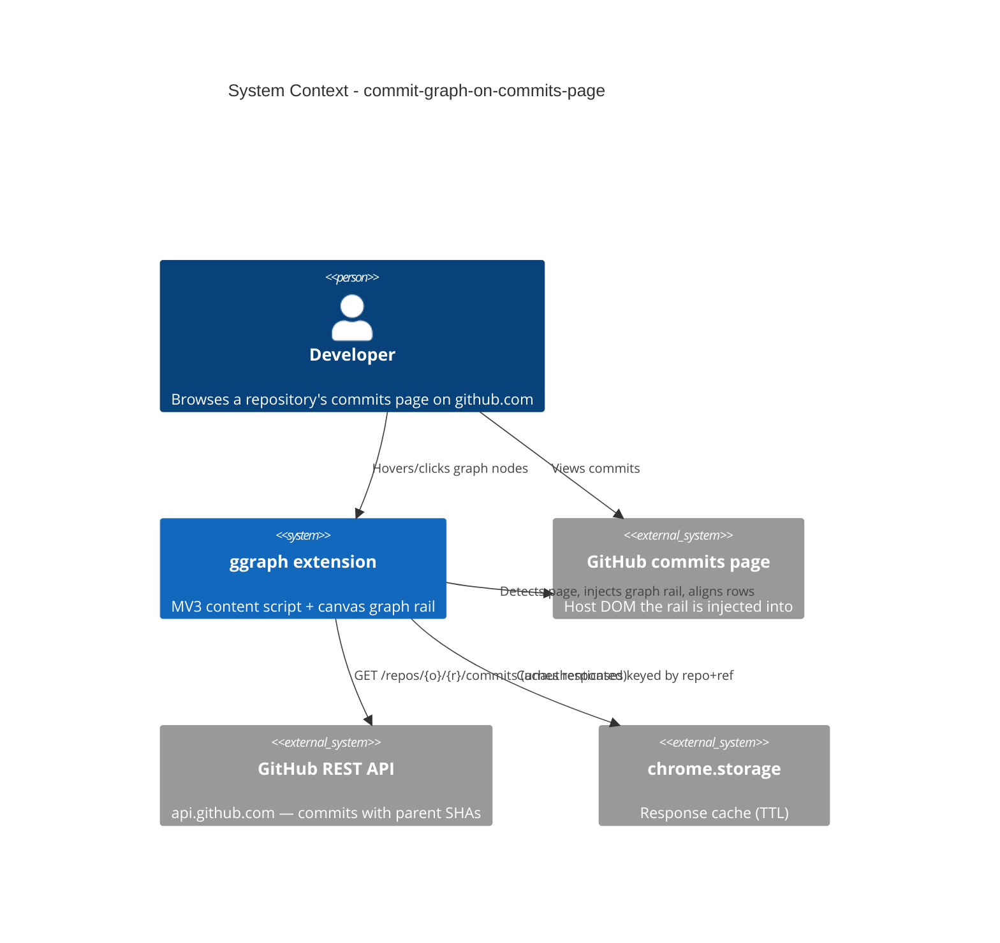

# Commit Graph on Commits Page - System Context

## System Overview

A Chrome MV3 extension that runs as a guest inside GitHub's commits page. A
content script detects the page, fetches commit data from the GitHub REST API,
computes a branch-integration DAG layout in a pure TypeScript module, and draws
it on a Canvas 2D rail aligned with GitHub's own commit list. Everything runs
client-side; no backend, no data leaves the browser.

## Context Diagram

## External Integrations

- **GitHub commits page (DOM)**: injection host. Inbound: page URL (owner/repo/ref),
  commit row positions for alignment. Undocumented structure — all selectors
  isolated in one module; SPA (Turbo) navigation events observed for attach/detach.
- **GitHub REST API**: `GET /repos/{owner}/{repo}/commits?sha={ref}&per_page=100`,
  JSON. Outbound requests only; unauthenticated (60 req/hr/IP).
- **chrome.storage**: cache of API responses (repo+ref key, TTL, bounded size).

## High-Level Constraints

- Chrome MV3; minimal permissions (host permissions for github.com +
  api.github.com, `storage`).
- No backend, no auth in this intent (auth is intent 002).
- Unauthenticated rate limit 60 req/hr/IP; conditional-request (304) exemption
  does NOT apply unauthenticated.
- Host-page safety: extension failures must never break the GitHub page.

## Key NFR Goals

- 500 commits: layout + draw < 100ms after data; 60fps scroll.
- Shipped JS (gzip) ≤ 100KB; ≤ 50MB extra heap.
- Layout core pure and benchmarked (`benchmarks/layout-bench.mjs`, < 10ms / 500 commits).
