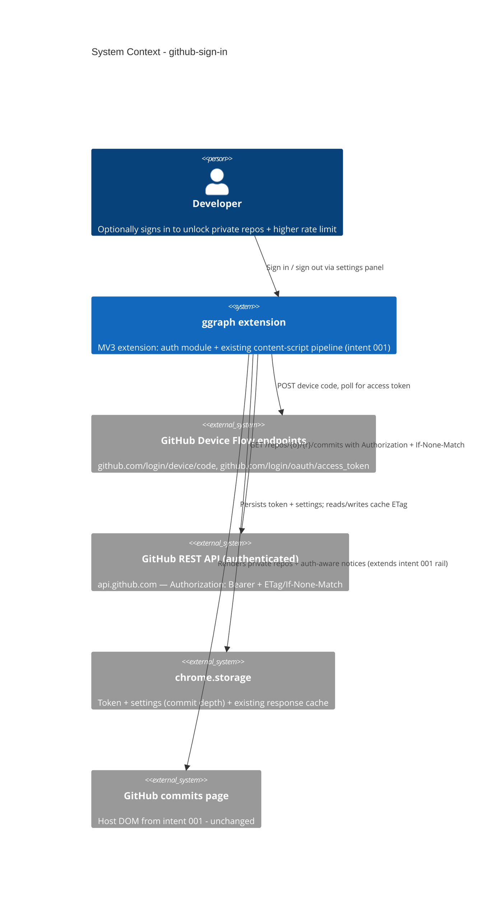

# GitHub Sign-In - System Context

## System Overview

Extends the existing MV3 extension (intent 001) with an optional
authenticated mode. A new auth module drives the OAuth Device Flow against
GitHub's own endpoints (no backend), stores the resulting token in
`chrome.storage`, and the existing commit-fetch/cache/degradation pipeline
is extended to use it when present. Signed-out behavior is unchanged from
intent 001.

## Context Diagram

## External Integrations

- **GitHub Device Flow endpoints**: `github.com/login/device/code` (device
  code request) and `github.com/login/oauth/access_token` (polling).
  Public-client OAuth 2.0 Device Authorization Grant — no `client_secret`.
  Already covered by the existing `https://github.com/*` host permission.
- **GitHub REST API (authenticated)**: same `GET /repos/{owner}/{repo}/commits`
  endpoint as intent 001, now with `Authorization: Bearer {token}` and
  `If-None-Match` headers; 5,000 req/hr, 304 exempt from that limit.
- **chrome.storage**: extends intent 001's response cache with an `etag`
  per entry (field already reserved), plus a new token/settings entry.
- **GitHub commits page (DOM)**: unchanged from intent 001 — this intent
  only changes which requests are made and what the degradation notices say.

## High-Level Constraints

- Chrome MV3; no new host permissions required.
- No backend, no `client_secret` — Device Flow only, per roadmap decision.
- A real `client_id` requires a maintainer to register a GitHub OAuth App
  (external boundary, not resolved by this intent's code).
- Must not change unauthenticated (signed-out) behavior from intent 001.

## Key NFR Goals

- Device-flow polling respects the server's `interval`; never hammers the
  endpoint.
- Token never logged, never stored outside `chrome.storage.local`.
- Authenticated fetch + ETag adds negligible overhead to intent 001's
  performance budget (<100ms/500 commits after data arrives).
