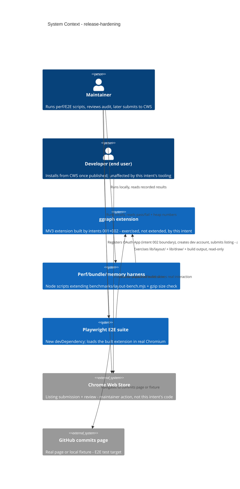

# Release Hardening - System Context

## System Overview

No new runtime system is introduced. This intent adds verification tooling
(a perf/bundle/memory harness, a Playwright E2E suite) and release artifacts
(privacy audit, store listing content, README, manifest fields, release
checklist) around the existing MV3 extension built by intents 001 and 002.
The extension's own runtime surface (`entrypoints/`, `lib/`) is exercised
read-only/as-a-black-box by the new tooling — it is not modified for new
behavior, only for release-readiness fields (manifest version/icons).

## Context Diagram

## External Integrations

- **Chrome Web Store**: the publish target. This intent prepares listing
  content, icons, and a privacy disclosure for it, but account creation and
  submission/review are maintainer actions (see requirements.md
  Assumptions/Scope) — not something this intent's code or scripts perform.
- **Playwright (new devDependency)**: drives a real Chromium instance to
  load the built, unpacked extension and exercise the commits-page flow.
  Not yet in `package.json`; the one new dependency this intent adds.
- **GitHub commits page (real or local fixture)**: the E2E test's
  navigation target — either a real public repo's commits page or a local
  HTML fixture reproducing the same DOM shape (Construction's call, see
  requirements.md Open Questions).
- **api.github.com / github.com (existing, from intents 001/002)**: not a
  new integration — the privacy audit (FR-5) confirms these two hosts are
  the *only* network destinations anywhere in the code.

## Internal Surfaces Exercised (Read-Only Unless Noted)

- `lib/layout/compute-layout.ts`, `lib/draw/draw.ts` — driven by the
  extended perf harness (FR-1); not modified.
- `benchmarks/layout-bench.mjs` — extended (not replaced) to add a draw
  measurement (FR-1).
- `.output/chrome-mv3/*` (build output) — read by the bundle-size script
  (FR-2) and loaded unpacked by the E2E suite (FR-4).
- `lib/github/fetch-commits.ts`, `lib/github/device-flow.ts`,
  `lib/github/token-store.ts`, `lib/github/cache.ts` — read (not modified)
  by the privacy/security audit (FR-5) to enumerate every outbound request
  and storage write.
- `wxt.config.ts` — **modified** for release-readiness only: `version` bump
  to `1.0.0`, `icons`/`action.default_icon` added (FR-6). No behavioral
  manifest change (permissions stay whatever FR-5's audit confirms are
  actually used).
- `package.json` — **modified** to add `@playwright/test` as a
  devDependency and new scripts (e.g. a bench/E2E/bundle-size command),
  consistent with the existing `bench`/`test`/`lint`/`typecheck` script
  pattern.

## High-Level Constraints

- Chrome MV3; no new `host_permissions` — this intent verifies, it does not
  extend, network access.
- No CI in this repo yet — all new scripts/tests must run locally with a
  documented command; CI wiring is out of scope.
- Must not change any signed-in/signed-out runtime behavior from intents
  001/002 — this intent is verification and documentation, not a feature
  change.

## Key NFR Goals

- Every performance/bundle/memory number in the release checklist is a
  **measured, recorded result**, never a restated assumption.
- The privacy disclosure text published to the Chrome Web Store is derived
  from, and consistent with, the FR-5 code audit — not written independently
  of it.
- The E2E suite proves the zero-config, host-page-safety, and basic
  interaction promises from the roadmap's Success Criteria still hold on
  the actual built artifact, not just in unit tests.
