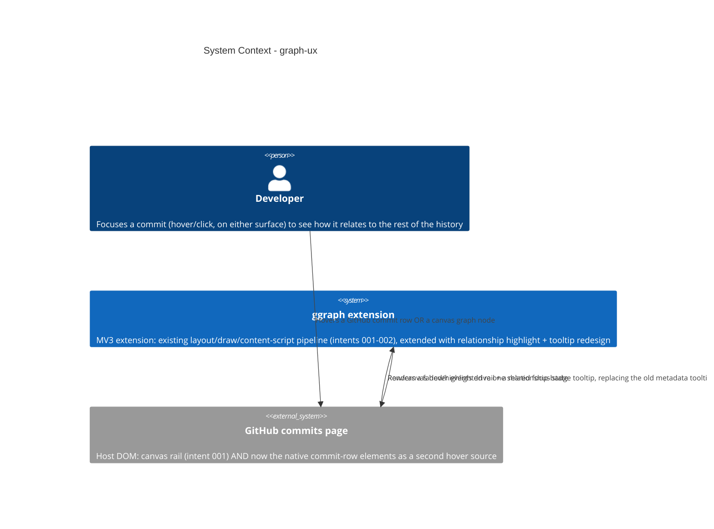

# Graph Relationship Highlight & Tooltips - System Context

## System Overview

Extends the existing MV3 extension's rendering pipeline (intent 001) with
relationship-aware interaction. No new data source, no new external system —
the same fetched/laid-out commits already on screen now drive a focus-aware
highlight (first-parent chain + merge edges, everything else faded) and a
redesigned tooltip that shows a relationship badge only on structurally
interesting commits. GitHub's own commit-row DOM elements (already collected
by intent 001's `lib/github/selectors.ts`) become a second hover source
alongside the canvas, in addition to being the render anchor they already are.

## Context Diagram

## External Integrations

- **GitHub commits page (DOM)**: no new integration — reuses the row
  elements `lib/github/selectors.ts` already collects (`findCommitRowEls`,
  `getRowSha`) as a second hover source, in addition to their existing role
  as the canvas rail's positioning anchor. No new REST calls, no new
  `chrome.storage` usage, no new host permissions.

## High-Level Constraints

- Chrome MV3; no new host permissions.
- No new network calls — this intent is rendering/interaction only, layered
  on data intents 001/002 already fetch.
- `lib/layout/` must stay pure (no DOM, network, or `chrome.*`).
- Must not regress intent 001's layout/draw performance budget or intent
  002's authenticated fetch path.
- Ref decoration badges (branch/tag heads) explicitly out of scope —
  deferred to a separate future effort per the decided design.

## Key NFR Goals

- Highlight recompute + redraw stays within the existing hover-driven
  redraw budget (recompute only on focused-row change, mirroring the
  existing `if (hit?.row !== highlight)` guard in
  `entrypoints/commits.content.ts`).
- Row-hover wiring degrades silently if GitHub's DOM changes, per intent
  001's established silent-failure contract (`findCommitRowEls` returning
  `[]`, `safe()`-wrapped handlers).
